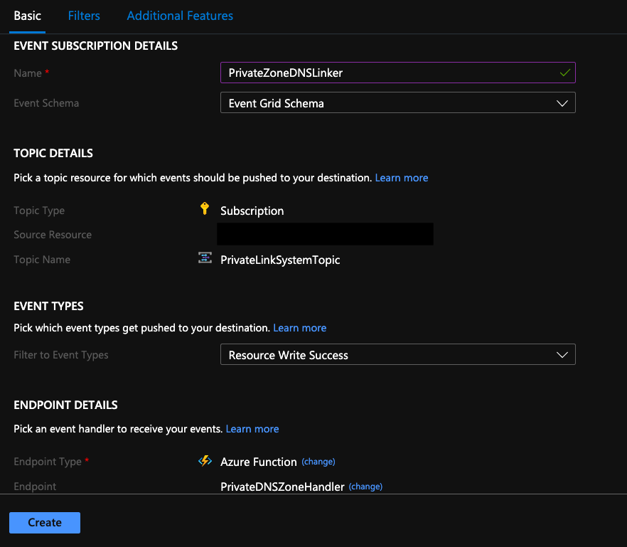
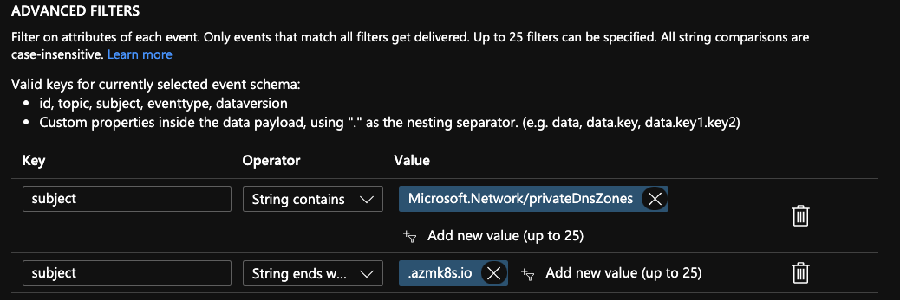

# Azure Private DNS Zone Linker Function

This function was built with the scenario in mind to link Private DNS Zones created by various Azure resources to a VNet containing custom DNS Servers. For instance, there is the need in Azure Kubernetes Service Private Clusters (at the time of writing) where users have to manually link the Private DNS Zone to the associated VNet containing their Custom DNS Setup.

This issue is called out in the documentation [here](https://docs.microsoft.com/en-us/azure/aks/private-clusters#hub-and-spoke-with-custom-dns).

## Prerequisites 
- Custom DNS servers setup in an Azure VNet or peered VNet or linked VNet
- A desire to have automatic linking of Private DNS Zones to a VNET with the above specifications 

## Setup Instructions
1. Create a new Azure Function (Linux v3) with Stack Node.js 12 LTS.
2. Enable System Assigned Managed Identity on the Function App and give the Managed Identity both Network Contributor and DNS Zone Contributor permissions on the Azure Subscription containing the VNet you would like to link the Zones to. 
3. Add a new Application Setting named `HUB_VNET_NAME` to the function app with a value of the resource id of the VNet you would like to link the Private Zones to. Save this configuration.
4. Open this source code in VSCode and use the Azure Functions Extension to publish the function to your recently created Function App.
5. Create a new **Event Grid System Topic** on the Azure Subscription that you would like to listen to new 'Private DNS Zone creation' events on. This will have Topic Type `Azure Subscriptions` and can be put in a Subscription/Resource Group of your choice. 
6. Once the System Topic is created, add an Event Subscription of Type `Event Grid Schema` that will filter on Event Type `Resource Write Success` and point it to your function.

7. Add Subscription Filters based on the Private Zones you would like to link to your VNet. For instance, if you would like to only link Private Zones created in your subscription by Azure Kubernetes Service, use the following Advanced Filters.

> **Note**: If you don't add any filters here then by default ALL Private Zones created in your Subscription will be linked to the associated VNet.